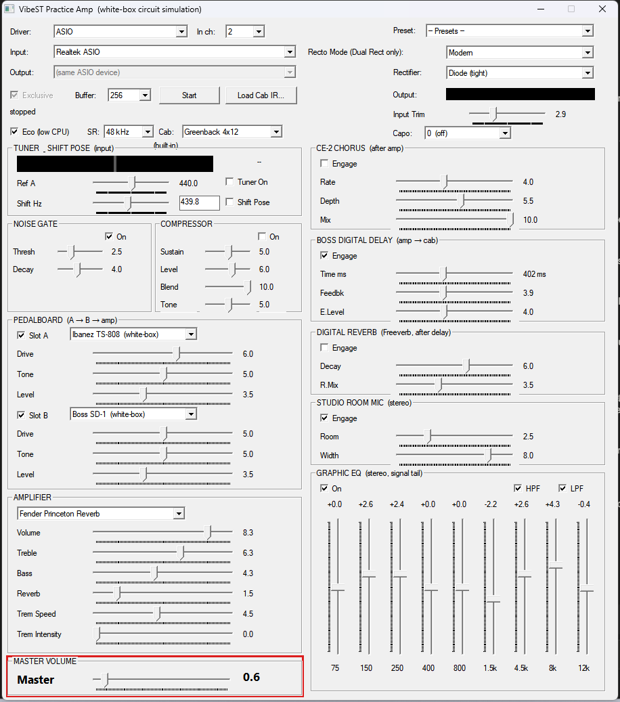
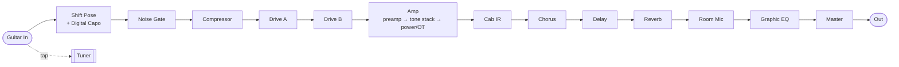

# VibeST Practice Amp

**A white-box, real-time guitar amp & pedal simulator for Windows.**
**一个纯白盒、实时的电吉他音箱 / 效果器模拟器(Windows)。**

  

The signal flows through this chain (every block is a physical circuit model, except the cab,
which is an impulse-response convolution):

---

## English

### What it is
VibeST is a standalone Windows app that recreates the sound of classic guitar amplifiers and
overdrive/distortion pedals. Instead of sampling a recording, it **simulates the actual analog
circuits** — vacuum-tube gain stages, diode clippers, op-amp EQs, tone stacks, output transformers
— sample by sample, in real time. It is *white-box*: the model is built from the schematic, and
every parameter comes from a real component value, a datasheet, a measurement, or a physical law.

### How the sound is restored
Each stage of a real amp/pedal is rebuilt as a small physical model, then the whole chain runs on
a real-time audio thread (no allocation, no locks) through ASIO or WASAPI. Nonlinear stages are
oversampled to keep aliasing out, and each model is checked against a **NAM (Neural Amp Modeler)**
capture of the real hardware — both by ear and by measurement (frequency response, harmonic
spectrum, THD vs. level).

| Circuit block | How it's modelled |
|---|---|
| Vacuum tubes (12AX7 / 6L6 …) | Koren triode/pentode equations |
| Diode / germanium clippers | Shockley / Ge diode I-V, solved each sample by a warm-started Newton-Raphson iteration (cheap — the state barely moves between samples at 48 kHz) |
| Op-amp tone / EQ stages | Modified Nodal Analysis (MNA) with ideal op-amps, bilinear-discretised |
| Tone stacks (Fender / Marshall / FMV) | Passive state-space networks with real pot/cap values |
| Output transformer | Leakage-inductance resonance biquad |
| Power-supply sag (Rectifier) | Envelope-driven B+ droop |
| Speaker cabinet | Impulse-response convolution |

### Features
**Amplifiers (4):** Fender Princeton Reverb (matched to 0.27 dB vs NAM), Marshall Super Lead Plexi,
Mesa Dual Rectifier (with Raw/Vintage/Modern voicing and Diode/Spongy rectifier sag; 1.7 dB),
Dumble Steel String Singer (1.37 dB).

**Pedals (8, two stackable slots A → B):** Boss OD-1, Boss SD-1 *(white-box + hybrid)*, Ibanez
TS-808 *(white-box + hybrid)*, Mad Professor Red, Klon Centaur, Marshall Bluesbreaker.
"white-box" pedals are NAM-validated; "(schematic)" pedals are built from the real schematic but
not yet instrument-verified (marked honestly).

**Dynamics (before the drives):** a separate Noise Gate (Threshold, Decay) and Compressor
(Sustain, Level, Blend, Tone).

**Post-amp effects:** CE-2 Chorus, Boss Digital Delay, Digital Reverb (Freeverb), Studio Room Mic
(stereo), 9-band Graphic EQ + HPF/LPF.

**Tools:** a chromatic Tuner (±2.5 cents, reference A adjustable 425–455 Hz); Shift Pose (fine
pitch retune with a typed Hz target, for playing along with off-440 recordings); a Digital Capo
(±12-fret transpose); Cab IR loader; output clip meter; factory presets with per-amp auto-load.

All knobs read 0–10 like a real amp. Eco (low-CPU) mode runs at 48 kHz and is on by default to
avoid ASIO overruns. The ASIO output can be set to 44.1 or 48 kHz (44.1 is resampled to the engine's
48 kHz core) to match your playback setup.

---

## 中文

### 这是什么
VibeST 是一个 Windows 独立软件,用来还原经典吉他音箱和过载/失真踏板的声音。它不是对录音采样,
而是**仿真真实的模拟电路**——电子管增益级、二极管削波、运放 EQ、tone stack、输出变压器——逐采样、
实时运行。它是**白盒**的:模型从**原理图**搭出来,每个参数都来自真实元件值、数据手册、实测或一条物理定律。

### 还原方法
真机每一级电路都被重建成一个小的物理模型,整条链跑在实时音频线程上(不分配内存、不加锁),走 ASIO 或
WASAPI。非线性级过采样防混叠;每个模型都对照真机的 **NAM(Neural Amp Modeler)采样**做核对——既用耳朵
听,也上仪器测(频响、谐波谱、THD-vs-电平)。

| 电路模块 | 建模方式 |
|---|---|
| 电子管(12AX7 / 6L6 …) | Koren 三极管 / 五极管方程 |
| 二极管 / 锗二极管削波 | Shockley / 锗管 I-V 方程,逐采样**热启动牛顿迭代**求解(很便宜——48 kHz 下相邻采样状态几乎不变) |
| 运放 tone / EQ 级 | 理想运放的改进节点分析(MNA),双线性离散 |
| Tone stack(Fender / Marshall / FMV) | 无源状态空间网络,真电位器 / 电容值 |
| 输出变压器 | 漏感谐振 biquad |
| 电源 sag(Rectifier) | 包络驱动的 B+ 下垂 |
| 喇叭箱体 | 脉冲响应(IR)卷积 |

### 功能
**音箱(4):** Fender Princeton Reverb(对 NAM 匹配到 0.27 dB)、Marshall Super Lead Plexi、
Mesa Dual Rectifier(带 Raw/Vintage/Modern 音色档 + Diode/Spongy 整流 sag;1.7 dB)、
Dumble Steel String Singer(1.37 dB)。

**踏板(8 个,两个可叠加插槽 A → B):** Boss OD-1、Boss SD-1 *(白盒 + hybrid)*、Ibanez TS-808
*(白盒 + hybrid)*、Mad Professor Red、Klon Centaur、Marshall Bluesbreaker。标 "white-box" 的经过
NAM 验证;标 "(schematic)" 的是按真图搭的、但还没上仪器验证(诚实标注)。

**动态(在失真前):** 独立的噪声门(Threshold、Decay)和压缩器(Sustain、Level、Blend、Tone)。

**后级效果:** CE-2 Chorus、Boss Digital Delay、Digital Reverb(Freeverb)、Studio Room Mic(立体声)、
9 段图示 EQ + HPF/LPF。

**工具:** 半音调音表(±2.5 音分,标准音 A 可调 425–455 Hz);Shift Pose(可手动输入目标 Hz 的微调移调,
用来跟非 440 标准音的老录音一起弹);数字变调夹(±12 品移调);Cab IR 加载;输出削波电平表;
工厂预设 + 换 amp 自动加载。

所有旋钮像真音箱一样读数 0–10。Eco(低 CPU)模式在 48 kHz 运行、默认开启,避免 ASIO 溢出。ASIO 输出
可选 44.1 或 48 kHz(44.1 会重采样到引擎的 48 kHz 核心),以匹配你的播放设置。

---

## Build / 构建

Windows · C++20 · native Win32 GUI · MinGW-w64. Full instructions (dependencies, exact `g++`
command, Python golden-reference tests) are in **[`vst/README.md`](vst/README.md)**.

完整构建说明(依赖、`g++` 命令、Python 对拍测试)见 **[`vst/README.md`](vst/README.md)**。

- `vst/src/engine/` — the white-box circuit engine (tube/diode/op-amp models, tone stacks, FX DSP)
- `vst/src/standalone/` — real-time audio wiring + the Win32 GUI front-end
- `proto/` — Python prototypes each C++ block is checked against, sample-for-sample

*Amp and pedal names refer to the circuits being studied and are trademarks of their respective
owners; this project is not affiliated with or endorsed by them.*
*音箱 / 踏板名称指代所研究的电路,是各自厂商的商标;本项目与其无隶属或背书关系。*
